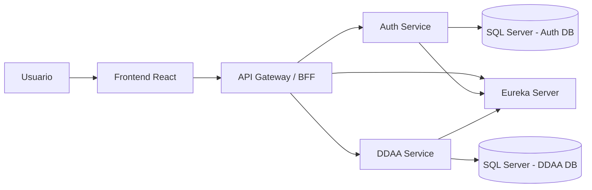

# DDAA Platform

## 1. Descripcion general

**DDAA Platform** es una solucion basada en microservicios para la gestion de derechos de aprovechamiento de aguas (DDAA). El proyecto implementa una arquitectura modular con autenticacion corporativa mediante Google, descubrimiento de servicios, gateway centralizado, BFF para el frontend y un microservicio de negocio para administrar derechos de agua.

El estado actual del proyecto corresponde a un **MVP funcional**. Actualmente permite:

- iniciar sesion mediante Google corporativo;
- validar que el usuario pertenezca al dominio permitido;
- consultar la sesion activa desde el frontend;
- listar derechos de agua registrados;
- crear nuevos derechos DDAA;
- editar derechos existentes;
- eliminar derechos registrados;
- cargar catalogos desde la base de datos para formularios;
- consultar detalle, expedientes y datos relacionados de un DDAA.

Componentes implementados:

- **Eureka Server** para descubrimiento de servicios.
- **API Gateway** como punto unico de entrada.
- **Auth Service** para autenticacion Google/OAuth2 y persistencia de usuarios.
- **DDAA Service** para logica de negocio, catalogos y CRUD de derechos de agua.
- **Frontend React + Vite** como interfaz web.
- **SQL Server** como base de datos principal.
- **H2** solo para pruebas automatizadas.
- **Swagger/OpenAPI** para documentacion de APIs.

La arquitectura esta preparada para crecer por modulos, incorporando nuevos microservicios o nuevas capacidades del dominio sin reestructurar todo el sistema.

---

## 2. Problematica abordada

La gestion de derechos de agua requiere mantener informacion consistente sobre titulares, comunas, fuentes, instalaciones, expedientes, ejercicios del derecho y pagos asociados. En una gestion manual o dispersa, esta informacion puede quedar fragmentada, dificultando la trazabilidad, la consulta historica y la toma de decisiones.

El proyecto propone una plataforma corporativa que centraliza la operacion inicial del dominio DDAA mediante una aplicacion web conectada a servicios backend. La solucion busca entregar una base tecnica escalable, segura y mantenible para futuras etapas de gestion documental, reporteria, trazabilidad y control por roles.

---

## 3. Arquitectura seleccionada

### 3.1 Arquitectura de microservicios

El proyecto usa una arquitectura de microservicios porque separa responsabilidades y permite evolucionar cada componente de forma independiente.

Servicios actuales:

| Servicio | Responsabilidad principal |
| --- | --- |
| `eureka-server` | Registro y descubrimiento de servicios. |
| `api-gateway` | Punto unico de entrada, seguridad perimetral, routing y BFF. |
| `auth-service` | Login Google, validacion de dominio y persistencia de usuarios. |
| `ddaa-service` | Dominio de derechos de agua, catalogos, consultas y CRUD. |
| `frontend` | Interfaz de usuario React. |

Esta separacion permite aislar autenticacion, dominio, infraestructura y experiencia de usuario. Tambien permite agregar futuros servicios, por ejemplo reporteria, documentos, auditoria o notificaciones.

### 3.2 Justificacion de la arquitectura

La arquitectura responde a los requerimientos del caso porque:

- centraliza el acceso externo a traves del API Gateway;
- protege los endpoints de negocio mediante sesion autenticada;
- desacopla el frontend de los microservicios internos;
- permite que los servicios se ubiquen dinamicamente mediante Eureka;
- facilita el crecimiento futuro del sistema;
- permite mantener separada la base de usuarios de la base del dominio DDAA;
- facilita pruebas del dominio usando H2 sin depender siempre de SQL Server.

---

## 4. Patrones de arquitectura aplicados

### 4.1 API Gateway Pattern

El `api-gateway` expone una entrada unica al sistema en:

```text
http://localhost:8080
```

Desde el gateway se enrutan las solicitudes hacia los servicios internos:

- `/auth/**`, `/oauth2/**`, `/login/**` y `/logout` hacia `auth-service`;
- `/api/**` hacia `ddaa-service`;
- `/bff/**` hacia controladores propios del gateway orientados al frontend.

El gateway tambien implementa un filtro de seguridad que protege rutas de negocio consultando la sesion activa en `auth-service` mediante `/auth/me`.

### 4.2 Service Discovery Pattern

`eureka-server` permite que los servicios se registren y sean resueltos por nombre logico. Esto evita depender de URLs fisicas fijas entre servicios.

Ejemplos de resolucion logica:

```text
lb://auth-service
lb://ddaa-service
```

En la capa BFF se utiliza `WebClient` con `@LoadBalanced`, lo que permite llamadas internas como:

```text
http://auth-service
http://ddaa-service
```

### 4.3 Backend for Frontend Pattern

El `api-gateway` incluye una capa BFF en el paquete `bff`. Esta capa entrega endpoints adaptados a las necesidades del frontend React.

Endpoints BFF principales:

```http
GET    /bff/session
GET    /bff/ddaa
GET    /bff/ddaa/form-options
GET    /bff/ddaa/{id}
POST   /bff/ddaa
PUT    /bff/ddaa/{id}
DELETE /bff/ddaa/{id}
```

El endpoint `/bff/ddaa/form-options` agrupa en una sola respuesta los catalogos necesarios para el formulario:

- comunas;
- titulares/RUTS;
- instalaciones;
- cuencas;
- subcuencas;
- fuentes.

Esto evita que el frontend tenga que conocer todos los endpoints internos de catalogos.

### 4.4 Database per Service

El proyecto aplica el principio de base de datos por servicio:

- `auth-service` usa una base SQL Server para usuarios y datos de autenticacion;
- `ddaa-service` usa una base SQL Server para el dominio de derechos de agua;
- H2 se usa solamente en pruebas automatizadas.

Esta separacion reduce el acoplamiento entre autenticacion y negocio.

### 4.5 Layered Architecture

Dentro de cada microservicio se aplica separacion por capas:

- `controller`: expone endpoints REST;
- `service`: concentra reglas de negocio y orquestacion;
- `repository`: acceso a datos mediante JPA o JDBC;
- `model`: entidades del dominio;
- `dto`: objetos de entrada y salida para no exponer directamente las entidades.

### 4.6 DTO Pattern

El proyecto usa DTOs para separar los contratos de API respecto de las entidades JPA. Esto permite controlar que datos se exponen al frontend y facilita cambios internos en el modelo sin romper el contrato externo.

### 4.7 Externalized Configuration

La configuracion sensible se mantiene fuera del codigo mediante `local.properties` y variables de entorno. Esto evita versionar credenciales y facilita cambiar configuracion entre ambientes.

---

## 5. Diagrama de arquitectura



### Flujo general

1. El usuario ingresa al frontend React.
2. El frontend consulta `/bff/session` para validar si existe sesion.
3. Si no hay sesion, el usuario inicia login mediante Google OAuth2.
4. `auth-service` valida el usuario y restringe el dominio permitido.
5. El frontend consume operaciones DDAA mediante `/bff/ddaa/**`.
6. El gateway valida sesion antes de permitir acceso a rutas protegidas.
7. El BFF consulta internamente `ddaa-service` usando Service Discovery.
8. `ddaa-service` consulta SQL Server para catalogos y CRUD de derechos.

---

## 6. Estructura del proyecto

```text
ddaa-platform/
├── api-gateway/
├── auth-service/
├── data/
│   └── scripts/
├── ddaa-service/
├── docs/
├── eureka-server/
├── frontend/
├── local.properties
└── readme.md
```

### Modulos principales

| Modulo | Estado | Responsabilidad |
| --- | --- | --- |
| `eureka-server` | Implementado | Registro y descubrimiento de servicios. |
| `api-gateway` | Implementado | Entrada unica, routing, seguridad y BFF. |
| `auth-service` | Implementado | Login Google, restriccion de dominio, sesion y usuarios internos. |
| `ddaa-service` | MVP funcional | Catalogos, consultas, detalle y CRUD DDAA. |
| `frontend` | MVP funcional | Interfaz React para login y CRUD DDAA. |
| `data/scripts` | Disponible | Scripts SQL auxiliares y datos de ejemplo. |

---

## 7. Estado actual del proyecto

### Implementado

- Registro de servicios con Eureka.
- Gateway con rutas hacia `auth-service` y `ddaa-service`.
- BFF para sesion y CRUD DDAA.
- Autenticacion Google OAuth2/OpenID Connect.
- Restriccion de acceso por dominio corporativo `camanchaca.cl`.
- Persistencia de usuarios internos en SQL Server.
- Frontend React con:
  - login;
  - validacion de sesion;
  - listado de derechos;
  - creacion de derechos;
  - edicion de derechos;
  - eliminacion de derechos;
  - carga de catalogos para formulario;
  - refresco automatico de lista y detalle despues de crear o editar un DDAA.
- `ddaa-service` con endpoints para:
  - CRUD DDAA;
  - catalogos;
  - detalle de derechos;
  - expedientes asociados;
  - pagos y ejercicios relacionados.
- Swagger/OpenAPI en `ddaa-service`.
- Swagger/OpenAPI acotado en `auth-service`.
- Prueba de integracion para ciclo CRUD DDAA.
- Uso de SQL Server para ejecucion real.
- Uso de H2 para pruebas automatizadas.

### Ajustes recientes

- Se corrigio el flujo de consulta de catalogos mediante `/bff/ddaa/form-options`.
- Se valido que los catalogos cargan correctamente desde SQL Server.
- Se identifico que `/api/**` via gateway requiere sesion autenticada, mientras que las pruebas directas contra `ddaa-service` se realizan por `8082`.
- Se corrigio el problema donde la pantalla podia requerir refrescar el navegador tras editar un derecho. Ahora, despues de `PUT /bff/ddaa/{id}`, el frontend vuelve a consultar la lista y el detalle actualizado.
- Se dejo documentado que el listado `/api/ddaa` depende de SQL manual en `DdaaQueryRepository`, por lo que los nombres de columnas deben mantenerse alineados con la base real.

### Pendiente o futuro

- Gestion avanzada de roles y permisos.
- Filtros y busquedas avanzadas en el frontend.
- Gestion documental completa.
- Auditoria de cambios por usuario.
- Observabilidad avanzada: logs centralizados, metricas y trazabilidad distribuida.
- Circuit breaker/retry para resiliencia entre microservicios.
- Despliegue cloud formal con contenedores.
- Pipeline CI/CD.
- Revision final de archivos sensibles antes de versionar.

---

## 8. Puertos de desarrollo

| Componente | Puerto | URL local |
| --- | ---: | --- |
| Eureka Server | 8761 | `http://localhost:8761` |
| API Gateway | 8080 | `http://localhost:8080` |
| Auth Service | 8081 | `http://localhost:8081` |
| DDAA Service | 8082 | `http://localhost:8082` |
| Frontend React | 5173 | `http://localhost:5173` |
| SQL Server | 1433 | `localhost:1433` |

---

## 9. Configuracion local

Los servicios importan configuracion local desde:

```text
local.properties
```

Variables usadas por `auth-service`:

```properties
DB_URL=jdbc:sqlserver://localhost:1433;databaseName=ddaa_auth;encrypt=true;trustServerCertificate=true
DB_USER=ddaa_user
DB_PASSWORD=tu_password
GOOGLE_CLIENT_ID=tu_google_client_id
GOOGLE_CLIENT_SECRET=tu_google_client_secret
ALLOWED_GOOGLE_DOMAIN=camanchaca.cl
FRONTEND_SUCCESS_URL=http://localhost:5173/
EUREKA_DEFAULT_ZONE=http://localhost:8761/eureka/
```

Variables usadas por `ddaa-service`:

```properties
DDAA_DB_URL=jdbc:sqlserver://localhost:1433;databaseName=ddaa;encrypt=true;trustServerCertificate=true
DDAA_DB_USER=ddaa_user
DDAA_DB_PASSWORD=tu_password
DDAA_DB_DRIVER=com.microsoft.sqlserver.jdbc.SQLServerDriver
DDAA_SQL_INIT_MODE=never
DDAA_JPA_DDL_AUTO=none
DDAA_SAMPLE_DATA_ENABLED=false
EUREKA_DEFAULT_ZONE=http://localhost:8761/eureka/
```

Para trabajar sobre una base real ya existente, se recomienda usar:

```properties
DDAA_JPA_DDL_AUTO=none
DDAA_SAMPLE_DATA_ENABLED=false
```

Esto evita que Hibernate intente modificar tablas existentes o cargar datos de ejemplo sobre una base real.

Nota de seguridad: `local.properties`, `.env`, `local_cloud.properties` y cualquier archivo con credenciales reales no deben subirse al repositorio.

---

## 10. Ejecucion local

Requisitos:

- Java 17.
- Maven o Maven Wrapper.
- Node.js y npm.
- SQL Server local.
- Credenciales Google OAuth configuradas.

Orden recomendado:

1. `eureka-server`
2. `auth-service`
3. `ddaa-service`
4. `api-gateway`
5. `frontend`

### Eureka Server

```powershell
cd eureka-server
.\mvnw.cmd spring-boot:run
```

### Auth Service

```powershell
cd auth-service
.\mvnw.cmd spring-boot:run
```

### DDAA Service

Si estas desde la raiz del proyecto:

```powershell
mvn -f ddaa-service\pom.xml spring-boot:run
```

### API Gateway

```powershell
cd api-gateway
.\mvnw.cmd spring-boot:run
```

### Frontend

```powershell
cd frontend
npm install
npm run dev
```

---

## 11. Endpoints relevantes

### 11.1 Auth Service via gateway

```http
GET http://localhost:8080/auth/test
GET http://localhost:8080/oauth2/authorization/google
GET http://localhost:8080/auth/me
GET http://localhost:8080/logout
GET http://localhost:8080/auth/users
```

### 11.2 BFF via gateway

```http
GET    http://localhost:8080/bff/session
GET    http://localhost:8080/bff/ddaa
GET    http://localhost:8080/bff/ddaa/form-options
GET    http://localhost:8080/bff/ddaa/{id}
POST   http://localhost:8080/bff/ddaa
PUT    http://localhost:8080/bff/ddaa/{id}
DELETE http://localhost:8080/bff/ddaa/{id}
```

### 11.3 DDAA Service via gateway

Estas rutas pasan por el gateway y requieren sesion autenticada:

```http
GET    http://localhost:8080/api/ddaa
GET    http://localhost:8080/api/ddaa/{id}
GET    http://localhost:8080/api/ddaa/{id}/expedientes
GET    http://localhost:8080/api/catalogos/cuencas
GET    http://localhost:8080/api/catalogos/subcuencas
GET    http://localhost:8080/api/catalogos/fuentes
GET    http://localhost:8080/api/catalogos/comunas
GET    http://localhost:8080/api/catalogos/ruts
GET    http://localhost:8080/api/catalogos/instalaciones
POST   http://localhost:8080/api/ddaa
PUT    http://localhost:8080/api/ddaa/{id}
DELETE http://localhost:8080/api/ddaa/{id}
```

### 11.4 DDAA Service directo para pruebas locales

Estas rutas permiten probar directamente el microservicio de negocio en desarrollo local:

```http
GET    http://localhost:8082/api/ddaa
GET    http://localhost:8082/api/ddaa/{id}
GET    http://localhost:8082/api/ddaa/{id}/expedientes
GET    http://localhost:8082/api/catalogos/comunas
GET    http://localhost:8082/api/catalogos/ruts
GET    http://localhost:8082/api/catalogos/instalaciones
GET    http://localhost:8082/api/catalogos/cuencas
GET    http://localhost:8082/api/catalogos/subcuencas
GET    http://localhost:8082/api/catalogos/fuentes
POST   http://localhost:8082/api/ddaa
PUT    http://localhost:8082/api/ddaa/{id}
DELETE http://localhost:8082/api/ddaa/{id}
```

---

## 12. Ejemplos para Postman

### Crear DDAA

```http
POST http://localhost:8080/bff/ddaa
Content-Type: application/json
```

```json
{
  "comunaId": "10102",
  "rutTitular": 11111111,
  "instalacionId": null,
  "fuenteId": 1,
  "nombreFuenteDerecho": "Fuente de prueba",
  "naturalezaDerecho": "Consuntivo",
  "tipoDerecho": "Aprovechamiento",
  "estadoDerecho": "Vigente"
}
```

### Editar DDAA

```http
PUT http://localhost:8080/bff/ddaa/1
Content-Type: application/json
```

```json
{
  "comunaId": "10102",
  "rutTitular": 11111111,
  "instalacionId": null,
  "fuenteId": 1,
  "nombreFuenteDerecho": "Fuente editada",
  "naturalezaDerecho": "Consuntivo",
  "tipoDerecho": "Aprovechamiento",
  "estadoDerecho": "Vigente"
}
```

### Eliminar DDAA

```http
DELETE http://localhost:8080/bff/ddaa/1
```

---

## 13. Swagger / OpenAPI

### DDAA Service

```text
http://localhost:8082/swagger-ui.html
http://localhost:8082/v3/api-docs
```

Documenta endpoints de:

- derechos DDAA;
- detalle por identificador;
- expedientes asociados;
- catalogos;
- creacion, actualizacion y eliminacion.

### Auth Service

```text
http://localhost:8081/swagger-ui.html
http://localhost:8081/v3/api-docs
```

Documenta endpoints REST propios del servicio de autenticacion. El flujo completo OAuth con Google se prueba principalmente desde navegador porque involucra redirecciones, cookies y callback externo.

---

## 14. Testing

### DDAA Service

Prueba de integracion principal:

```text
ddaa-service/src/test/java/com/ddaa/ddaaservice/DdaaCrudIntegrationTest.java
```

Valida el ciclo:

1. preparacion de datos referenciales;
2. creacion de DDAA;
3. consulta;
4. actualizacion;
5. eliminacion.

Ejecucion:

```powershell
mvn -f ddaa-service\pom.xml test
```

### Frontend

```powershell
cd frontend
npm run dev
npm run build
npm run lint
```

---

## 15. Seguridad, privacidad y sostenibilidad

### Seguridad

- Autenticacion mediante Google OAuth2/OpenID Connect.
- Restriccion por dominio corporativo.
- Validacion de sesion desde gateway antes de acceder a rutas de negocio.
- Uso de cookies/sesion para mantener autenticacion.
- Separacion de rutas publicas y protegidas.
- Credenciales fuera del codigo fuente mediante `local.properties`.

### Privacidad

- Los datos de autenticacion se gestionan en `auth-service`.
- El frontend no accede directamente a credenciales ni secretos.
- El BFF evita exponer detalles internos innecesarios al cliente.
- Se recomienda no versionar archivos locales con datos sensibles.

### Sostenibilidad tecnica

- Separacion de responsabilidades por microservicio.
- Uso de Service Discovery para evitar dependencias rigidas de ubicacion.
- DTOs para mantener contratos estables.
- Pruebas automatizadas del ciclo CRUD.
- Arquitectura preparada para agregar nuevos servicios sin reescribir el sistema completo.

---

## 16. Herramientas y estrategias utilizadas

| Herramienta / estrategia | Aporte al proyecto |
| --- | --- |
| Spring Boot | Permite crear microservicios REST de forma rapida y estructurada. |
| Spring Cloud Gateway | Centraliza el acceso y aplica seguridad perimetral. |
| Eureka | Facilita descubrimiento de servicios y desacopla URLs internas. |
| Spring Security OAuth2 | Permite login corporativo con Google. |
| WebClient | Permite comunicacion reactiva entre gateway/BFF y microservicios. |
| JPA/Hibernate | Facilita operaciones CRUD sobre entidades del dominio. |
| JdbcTemplate | Permite resolver consultas complejas con joins especificos. |
| SQL Server | Base de datos relacional para usuarios y dominio DDAA. |
| H2 | Base liviana para pruebas automatizadas. |
| Swagger/OpenAPI | Documenta contratos REST y facilita pruebas manuales. |
| React + Vite | Frontend moderno y liviano para el MVP. |
| Postman | Pruebas manuales de endpoints durante desarrollo. |

---

## 17. Troubleshooting

### `/api/catalogos/comunas` por gateway devuelve 401

Esto es esperado si se consulta sin sesion autenticada:

```text
http://localhost:8080/api/catalogos/comunas
```

Las rutas `/api/**` por gateway estan protegidas. Para probar sin pasar por autenticacion, usar el servicio directo:

```text
http://localhost:8082/api/catalogos/comunas
```

### `/bff/ddaa/form-options` funciona, pero `/bff/ddaa` devuelve 500

Esto indica que los catalogos estan bien, pero falla el listado de derechos. Revisar:

```text
ddaa-service/src/main/java/com/ddaa/ddaaservice/repository/DdaaQueryRepository.java
```

Especialmente el SQL `DDAA_SUMMARY_SQL`, que debe estar alineado con los nombres reales de columnas en SQL Server.

### Postman muestra una ruta con `%0A`

`%0A` significa que la URL tiene un salto de linea al final. Se debe borrar y escribir la URL manualmente.

Ejemplo incorrecto:

```text
/api/catalogos/comunas%0A
```

Ejemplo correcto:

```text
/api/catalogos/comunas
```

### El frontend no actualiza despues de editar

Se agrego refresco automatico despues de guardar cambios. El flujo correcto tras editar es:

1. ejecutar `PUT /bff/ddaa/{id}`;
2. volver a consultar `GET /bff/ddaa`;
3. volver a consultar `GET /bff/ddaa/{id}`;
4. actualizar lista y panel de detalle sin recargar el navegador.

### `ddaa-service` no lee `local.properties`

`spring.config.import=optional:file:./local.properties` busca el archivo segun el directorio desde donde se ejecuta el comando. Si se ejecuta desde la raiz, usar:

```powershell
mvn -f ddaa-service\pom.xml spring-boot:run
```

O copiar temporalmente `local.properties` dentro de `ddaa-service` para pruebas locales.

---

## 18. Evidencia recomendada para la entrega

Se recomienda agregar capturas de pantalla de:

1. Eureka mostrando `api-gateway`, `auth-service` y `ddaa-service` registrados.
2. Login exitoso con Google corporativo.
3. Frontend mostrando usuario autenticado.
4. Pantalla principal con listado de derechos.
5. Formulario de creacion DDAA con catalogos cargados.
6. Edicion de un DDAA y refresco del dato actualizado.
7. Eliminacion de un DDAA.
8. Swagger UI de `ddaa-service`.
9. Postman probando `/bff/ddaa/form-options`.
10. Prueba directa de `ddaa-service` en `8082`.

---

## 19. Evaluacion frente a requerimientos

El proyecto cumple con una base tecnica consistente para una solucion corporativa de gestion DDAA. La implementacion incorpora microservicios, gateway, service discovery, autenticacion corporativa, BFF, base de datos relacional, documentacion de APIs, frontend funcional y pruebas de integracion.

La arquitectura propuesta responde a la necesidad de escalabilidad y modularidad, ya que separa autenticacion, acceso, descubrimiento y dominio de negocio. Tambien considera seguridad mediante OAuth2 y proteccion centralizada de rutas. A nivel operativo, el uso de Swagger, Postman, configuracion externa y pruebas automatizadas facilita la validacion tecnica del sistema.

Como MVP, el sistema ya permite ejecutar el flujo principal de derechos de agua: listar, crear, editar y eliminar registros. Para una version productiva, los siguientes pasos importantes serian agregar roles, auditoria, gestion documental, filtros avanzados, observabilidad, despliegue cloud y CI/CD.
