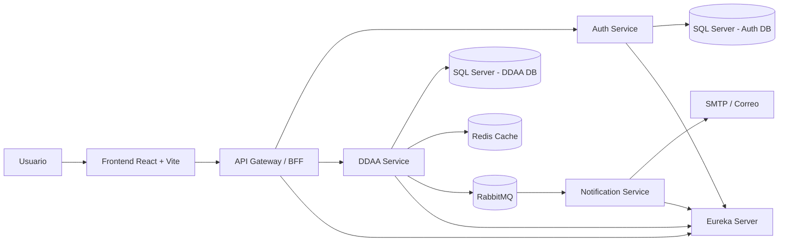

# DDAA Platform

## 1. Descripción general

**DDAA Platform** es una aplicación basada en microservicios para la gestión de derechos de aprovechamiento de aguas (**DDAA**). El proyecto implementa una arquitectura modular con autenticación corporativa mediante Google, descubrimiento de servicios, API Gateway, capa BFF, microservicio de negocio, caché con Redis, mensajería con RabbitMQ, notificaciones y frontend React.

El estado actual corresponde a un **MVP funcional extendido**. La plataforma permite:

- iniciar sesión mediante Google OAuth2/OpenID Connect;
- validar que el usuario pertenezca al dominio corporativo permitido;
- consultar la sesión activa desde el frontend;
- listar derechos de aprovechamiento de aguas registrados;
- crear, editar y eliminar registros DDAA;
- cargar catálogos desde base de datos para formularios;
- consultar detalle, expedientes y datos relacionados de un DDAA;
- aplicar caché Redis en consultas relevantes del dominio;
- publicar eventos de dominio mediante RabbitMQ;
- consumir eventos desde un microservicio de notificaciones;
- ejecutar pruebas automatizadas backend y frontend;
- generar reportes de cobertura con JaCoCo y Vitest.

La solución está pensada como una base técnica escalable, didáctica y mantenible para futuras etapas de trazabilidad, reportería, gestión documental, auditoría y control de permisos.

---

## 2. Problema abordado

La gestión de derechos de agua requiere mantener información consistente sobre titulares, comunas, fuentes, instalaciones, expedientes, ejercicios del derecho y pagos asociados. Cuando esta información se administra de forma manual o dispersa, se dificulta la trazabilidad, la consulta histórica y la toma de decisiones.

Este proyecto propone una plataforma web corporativa que centraliza el flujo inicial de administración DDAA mediante una interfaz React y un conjunto de servicios backend desacoplados.

---

## 3. Arquitectura general

El proyecto usa una arquitectura de microservicios. Cada módulo cumple una responsabilidad clara y puede evolucionar de forma independiente.

| Módulo | Tipo | Responsabilidad principal |
| --- | --- | --- |
| [`eureka-server`](eureka-server/README.md) | Infraestructura | Registro y descubrimiento de servicios. |
| [`api-gateway`](api-gateway/README.md) | Infraestructura / BFF | Punto único de entrada, routing, seguridad perimetral y endpoints BFF. |
| [`auth-service`](auth-service/README.md) | Microservicio backend | Login Google, validación de dominio, usuarios internos y emisión de JWT. |
| [`ddaa-service`](ddaa-service/README.md) | Microservicio backend | Lógica de negocio DDAA, CRUD, catálogos, Redis y publicación de eventos. |
| [`notification-service`](notification-service/README.md) | Microservicio backend | Consumo de eventos RabbitMQ y envío de notificaciones por correo. |
| [`frontend`](frontend/README.md) | Cliente web | Interfaz React + Vite para login y administración DDAA. |
| `data/scripts` | Datos / SQL | Scripts auxiliares para base de datos y datos de apoyo. |

### Justificación

Esta arquitectura permite:

- separar autenticación, dominio, notificaciones, infraestructura y frontend;
- centralizar el acceso externo mediante API Gateway;
- proteger rutas de negocio antes de llegar a los microservicios internos;
- desacoplar el frontend de los endpoints internos mediante BFF;
- resolver servicios por nombre lógico usando Eureka;
- mejorar rendimiento con Redis en consultas frecuentes;
- desacoplar acciones secundarias mediante eventos RabbitMQ;
- probar cada módulo de forma aislada;
- extender la solución agregando nuevos servicios sin reescribir el sistema completo.

---

## 4. Diagrama de arquitectura



### Flujo principal

1. El usuario entra al frontend React.
2. El frontend consulta `/bff/session` para validar sesión activa.
3. Si no hay sesión, se inicia login mediante Google.
4. `auth-service` valida el usuario y el dominio permitido.
5. El frontend consume operaciones del dominio mediante `/bff/ddaa/**`.
6. `api-gateway` valida sesión antes de permitir acceso a rutas protegidas.
7. `ddaa-service` ejecuta la lógica de negocio y consulta SQL Server.
8. Redis almacena respuestas de consultas frecuentes para mejorar rendimiento.
9. Cuando se crea, actualiza o elimina un DDAA, `ddaa-service` publica un evento en RabbitMQ.
10. `notification-service` consume el evento y envía la notificación configurada.

---

## 5. Patrones y decisiones técnicas

### API Gateway Pattern

`api-gateway` expone una entrada única al backend:

```text
http://localhost:8080
```

Desde este punto se enrutan rutas de autenticación, negocio y BFF hacia los servicios correspondientes.

### Backend for Frontend Pattern

El gateway incluye endpoints `/bff/**` diseñados para el frontend. Esto permite que React no tenga que conocer todos los endpoints internos de `auth-service` y `ddaa-service`.

Endpoints BFF principales:

```http
GET    /bff/session
GET    /bff/ddaa
GET    /bff/ddaa/form-options
GET    /bff/ddaa/{id}
POST   /bff/ddaa
PUT    /bff/ddaa/{id}
DELETE /bff/ddaa/{id}
```

### Service Discovery Pattern

`eureka-server` permite registrar y resolver servicios por nombre lógico:

```text
lb://auth-service
lb://ddaa-service
```

Esto evita depender de URLs físicas fijas entre servicios.

### Database per Service

El proyecto separa la persistencia por responsabilidad:

- `auth-service` usa una base SQL Server para usuarios y autenticación.
- `ddaa-service` usa una base SQL Server para el dominio DDAA.
- H2 se usa en pruebas automatizadas.

### Cache Aside con Redis

`ddaa-service` usa Redis para cachear consultas relevantes, como catálogos, listado y detalle DDAA. Las operaciones de escritura invalidan caché para evitar respuestas obsoletas.

### Event-Driven Architecture con RabbitMQ

`ddaa-service` publica eventos de dominio cuando ocurre una operación importante. `notification-service` consume esos eventos y ejecuta acciones de notificación sin acoplarse directamente al servicio de negocio.

### Layered Architecture

Los microservicios backend separan responsabilidades por capas:

```text
controller -> service -> repository -> model/dto
```

Esta separación facilita pruebas, mantenimiento y explicación del código.

---

## 6. Estructura del proyecto

```text
ddaa_platform/
├── api-gateway/
│   └── README.md
├── auth-service/
│   └── README.md
├── data/
│   └── scripts/
├── ddaa-service/
│   └── README.md
├── eureka-server/
│   └── README.md
├── frontend/
│   └── README.md
├── notification-service/
│   └── README.md
├── docker-compose.yml
├── docker-compose.redis.yml
├── .gitignore
└── readme.md
```

Los README internos explican el rol, configuración, endpoints y pruebas de cada módulo. El README raíz resume la solución completa.

---

## 7. Tecnologías utilizadas

| Área | Herramientas |
| --- | --- |
| Backend | Java 17, Spring Boot, Spring Web MVC, WebFlux en Gateway |
| Gateway | Spring Cloud Gateway |
| Descubrimiento | Spring Cloud Netflix Eureka |
| Seguridad | Spring Security, OAuth2 Client, JWT |
| Persistencia | SQL Server, Spring Data JPA, Spring JDBC |
| Pruebas backend | JUnit 5, Mockito, AssertJ, Spring Boot Test, H2 |
| Cobertura backend | JaCoCo |
| Caché | Redis, Spring Cache |
| Mensajería | RabbitMQ, Spring AMQP |
| Notificaciones | Spring Mail, SMTP |
| Frontend | React, Vite, JavaScript |
| Pruebas frontend | Vitest, Testing Library, jsdom |
| Documentación API | Swagger / OpenAPI |
| Infraestructura local | Docker Compose |

---

## 8. Puertos de desarrollo

| Componente | Puerto | URL local |
| --- | ---: | --- |
| Eureka Server | 8761 | `http://localhost:8761` |
| API Gateway | 8080 | `http://localhost:8080` |
| Auth Service | 8081 | `http://localhost:8081` |
| DDAA Service | 8082 | `http://localhost:8082` |
| Notification Service | 8083 | `http://localhost:8083` |
| Frontend React | 5173 | `http://localhost:5173` |
| SQL Server | 1433 | `localhost:1433` |
| Redis | 6379 | `localhost:6379` |
| RabbitMQ AMQP | 5672 | `localhost:5672` |
| RabbitMQ Management | 15672 | `http://localhost:15672` |

---

## 9. Configuración local

Los servicios leen configuración local desde:

```text
local.properties
```

Este archivo no debe contenerse en commits si tiene credenciales reales.

### Variables comunes

```properties
EUREKA_DEFAULT_ZONE=http://localhost:8761/eureka/
JWT_SECRET=ddaa-development-secret-key-change-me-1234567890
JWT_EXPIRATION_MINUTES=60
```

### Auth Service

```properties
DB_URL=jdbc:sqlserver://localhost:1433;databaseName=ddaa_auth;encrypt=true;trustServerCertificate=true
DB_USER=ddaa_user
DB_PASSWORD=tu_password
GOOGLE_CLIENT_ID=tu_google_client_id
GOOGLE_CLIENT_SECRET=tu_google_client_secret
ALLOWED_GOOGLE_DOMAIN=camanchaca.cl
FRONTEND_SUCCESS_URL=http://localhost:5173/
```

### DDAA Service

```properties
DDAA_DB_URL=jdbc:sqlserver://localhost:1433;databaseName=ddaa;encrypt=true;trustServerCertificate=true
DDAA_DB_USER=ddaa_user
DDAA_DB_PASSWORD=tu_password
DDAA_DB_DRIVER=com.microsoft.sqlserver.jdbc.SQLServerDriver
DDAA_SQL_INIT_MODE=never
DDAA_JPA_DDL_AUTO=none
DDAA_SAMPLE_DATA_ENABLED=false
DDAA_REDIS_HOST=localhost
DDAA_REDIS_PORT=6379
DDAA_CACHE_TTL=10m
DDAA_RABBITMQ_HOST=localhost
DDAA_RABBITMQ_PORT=5672
DDAA_RABBITMQ_USERNAME=ddaa
DDAA_RABBITMQ_PASSWORD=ddaa
```

### Notification Service

```properties
DDAA_RABBITMQ_HOST=localhost
DDAA_RABBITMQ_PORT=5672
DDAA_RABBITMQ_USERNAME=ddaa
DDAA_RABBITMQ_PASSWORD=ddaa
DDAA_MAIL_HOST=smtp.gmail.com
DDAA_MAIL_PORT=587
DDAA_MAIL_USERNAME=tu_correo
DDAA_MAIL_PASSWORD=tu_app_password
DDAA_MAIL_FROM=tu_correo
DDAA_MAIL_TO=destinatario_prueba
```

Para trabajar con una base real existente se recomienda mantener:

```properties
DDAA_JPA_DDL_AUTO=none
DDAA_SAMPLE_DATA_ENABLED=false
```

---

## 10. Ejecución local

### Requisitos

- Java 17.
- Maven o Maven Wrapper.
- Node.js y npm.
- Docker Desktop, para Redis y RabbitMQ.
- SQL Server local.
- Credenciales Google OAuth configuradas.

### Levantar infraestructura local

Redis:

```powershell
docker compose -f docker-compose.redis.yml up -d
```

RabbitMQ:

```powershell
docker compose up -d
```

La consola de RabbitMQ queda disponible en:

```text
http://localhost:15672
```

Credenciales por defecto para desarrollo:

```text
usuario: ddaa
password: ddaa
```

### Orden recomendado de ejecución

1. `eureka-server`
2. Redis y RabbitMQ
3. `auth-service`
4. `ddaa-service`
5. `notification-service`
6. `api-gateway`
7. `frontend`

### Comandos por módulo

Eureka:

```powershell
cd eureka-server
.\mvnw.cmd spring-boot:run
```

Auth Service:

```powershell
cd auth-service
.\mvnw.cmd spring-boot:run
```

DDAA Service:

```powershell
mvn -f ddaa-service\pom.xml spring-boot:run
```

Notification Service:

```powershell
mvn -f notification-service\pom.xml spring-boot:run
```

API Gateway:

```powershell
cd api-gateway
.\mvnw.cmd spring-boot:run
```

Frontend:

```powershell
cd frontend
npm install
npm run dev
```

---

## 11. Endpoints principales

### Autenticación vía Gateway

```http
GET http://localhost:8080/auth/test
GET http://localhost:8080/oauth2/authorization/google
GET http://localhost:8080/auth/me
GET http://localhost:8080/logout
GET http://localhost:8080/auth/users
```

### BFF vía Gateway

```http
GET    http://localhost:8080/bff/session
GET    http://localhost:8080/bff/ddaa
GET    http://localhost:8080/bff/ddaa/form-options
GET    http://localhost:8080/bff/ddaa/{id}
POST   http://localhost:8080/bff/ddaa
PUT    http://localhost:8080/bff/ddaa/{id}
DELETE http://localhost:8080/bff/ddaa/{id}
```

### DDAA Service vía Gateway

Estas rutas pasan por el gateway y requieren sesión autenticada:

```http
GET    http://localhost:8080/api/ddaa
GET    http://localhost:8080/api/ddaa/{id}
GET    http://localhost:8080/api/ddaa/{id}/expedientes
GET    http://localhost:8080/api/catalogos/comunas
GET    http://localhost:8080/api/catalogos/ruts
GET    http://localhost:8080/api/catalogos/instalaciones
GET    http://localhost:8080/api/catalogos/cuencas
GET    http://localhost:8080/api/catalogos/subcuencas
GET    http://localhost:8080/api/catalogos/fuentes
POST   http://localhost:8080/api/ddaa
PUT    http://localhost:8080/api/ddaa/{id}
DELETE http://localhost:8080/api/ddaa/{id}
```

### DDAA Service directo para pruebas locales

```http
GET    http://localhost:8082/api/ddaa
GET    http://localhost:8082/api/ddaa/{id}
GET    http://localhost:8082/api/catalogos/comunas
GET    http://localhost:8082/api/catalogos/ruts
GET    http://localhost:8082/api/catalogos/instalaciones
GET    http://localhost:8082/api/catalogos/cuencas
GET    http://localhost:8082/api/catalogos/subcuencas
GET    http://localhost:8082/api/catalogos/fuentes
POST   http://localhost:8082/api/ddaa
PUT    http://localhost:8082/api/ddaa/{id}
DELETE http://localhost:8082/api/ddaa/{id}
```

---

## 12. Swagger / OpenAPI

DDAA Service:

```text
http://localhost:8082/swagger-ui.html
http://localhost:8082/v3/api-docs
```

Auth Service:

```text
http://localhost:8081/swagger-ui.html
http://localhost:8081/v3/api-docs
```

El flujo OAuth2 completo se prueba principalmente desde navegador porque incluye redirecciones, sesión y callback de Google.

---

## 13. Testing y cobertura

### Backend

Ejecutar pruebas por módulo:

```powershell
mvn -f api-gateway\pom.xml test
mvn -f auth-service\pom.xml test
mvn -f ddaa-service\pom.xml test
mvn -f eureka-server\pom.xml test
mvn -f notification-service\pom.xml test
```

Generar cobertura JaCoCo:

```powershell
mvn -f api-gateway\pom.xml test jacoco:report
mvn -f auth-service\pom.xml test jacoco:report
mvn -f ddaa-service\pom.xml test jacoco:report
mvn -f notification-service\pom.xml test jacoco:report
```

Reportes esperados:

```text
api-gateway/target/site/jacoco/index.html
auth-service/target/site/jacoco/index.html
ddaa-service/target/site/jacoco/index.html
notification-service/target/site/jacoco/index.html
```

Cobertura actual esperada por tipo de prueba:

| Módulo | Pruebas principales |
| --- | --- |
| `api-gateway` | BFF Controller, BFF Service y filtro de autenticación. |
| `auth-service` | Auth Controller y lógica de usuarios. |
| `ddaa-service` | Contexto Spring y ciclo CRUD integrado con H2. |
| `eureka-server` | Carga de contexto. |
| `notification-service` | Carga de contexto y validación básica del módulo. |

### Frontend

Ejecutar pruebas:

```powershell
cd frontend
npm install
npm run test:run
```

Generar cobertura:

```powershell
npm run coverage
```

Validaciones adicionales:

```powershell
npm run lint
npm run build
```

Las pruebas frontend usan Vitest, Testing Library y jsdom para validar componentes, estados de sesión, servicios de API y comportamiento de la interfaz sin depender del backend real.

---

## 14. Seguridad y privacidad

### Seguridad implementada

- Login mediante Google OAuth2/OpenID Connect.
- Restricción por dominio corporativo permitido.
- Validación centralizada de sesión desde `api-gateway`.
- Separación de rutas públicas y protegidas.
- JWT generado por `auth-service` para transportar identidad y rol.
- Configuración sensible fuera del código fuente.

### Buenas prácticas pendientes para producción

- Gestionar secretos mediante un vault o variables del entorno de despliegue.
- Revisar roles y permisos por endpoint.
- Configurar CORS y cookies según dominio real.
- Activar HTTPS extremo a extremo.
- Agregar auditoría de cambios por usuario.

---

## 15. Estado actual del proyecto

### Implementado

- Arquitectura de microservicios con Eureka.
- API Gateway con routing y BFF.
- Autenticación Google con restricción de dominio.
- Persistencia de usuarios internos.
- Frontend React para login y CRUD DDAA.
- Microservicio de dominio con CRUD, catálogos y detalle DDAA.
- Swagger/OpenAPI en servicios principales.
- Redis integrado en `ddaa-service`.
- RabbitMQ integrado para eventos de dominio.
- `notification-service` como consumidor de eventos.
- Pruebas automatizadas backend.
- Pruebas automatizadas frontend con Vitest.
- Reportes de cobertura backend con JaCoCo.
- Reportes de cobertura frontend con Vitest/V8.
- README por módulo.

### Pendiente o futuro

- Gestión avanzada de roles y permisos.
- Filtros y búsqueda avanzada en frontend.
- Gestión documental completa.
- Auditoría funcional por usuario.
- Observabilidad avanzada: logs centralizados, métricas y trazabilidad distribuida.
- Circuit breaker y retry para resiliencia.
- Despliegue cloud formal con contenedores.
- Pipeline CI/CD.

---

## 16. Troubleshooting

### `/api/**` por gateway devuelve 401

Es esperado si no existe sesión autenticada. Para probar endpoints DDAA sin pasar por autenticación, usar el servicio directo en `8082`.

```text
http://localhost:8082/api/catalogos/comunas
```

### El gateway no encuentra servicios

Verificar que Eureka esté iniciado y que los servicios aparezcan registrados en:

```text
http://localhost:8761
```

### Redis no responde

Levantar Redis:

```powershell
docker compose -f docker-compose.redis.yml up -d
```

Luego verificar que `DDAA_REDIS_HOST` y `DDAA_REDIS_PORT` apunten a `localhost:6379`.

### RabbitMQ no responde

Levantar RabbitMQ:

```powershell
docker compose up -d
```

Luego revisar la consola:

```text
http://localhost:15672
```

### `notification-service` no envía correos

Revisar variables SMTP:

```properties
DDAA_MAIL_USERNAME=
DDAA_MAIL_PASSWORD=
DDAA_MAIL_FROM=
DDAA_MAIL_TO=
```

En Gmail normalmente se requiere una contraseña de aplicación y no la contraseña normal de la cuenta.

### `local.properties` no se lee

Los servicios importan `local.properties` desde la ruta de ejecución. Si un servicio se ejecuta desde la raíz con `mvn -f`, mantener el archivo en la raíz. Si se ejecuta desde la carpeta del módulo, puede ser necesario copiarlo temporalmente al módulo o ajustar la ruta de importación.

---

## 17. Evidencia recomendada para entrega

Para documentar la entrega final se recomienda capturar:

1. Eureka mostrando servicios registrados.
2. Login exitoso con Google.
3. Frontend mostrando usuario autenticado.
4. Listado de DDAA.
5. Formulario de creación con catálogos cargados.
6. Creación, edición y eliminación de un DDAA.
7. Swagger UI de `ddaa-service`.
8. Swagger UI de `auth-service`.
9. Redis ejecutándose con Docker.
10. RabbitMQ Management con cola/eventos.
11. Ejecución de pruebas backend.
12. Reporte JaCoCo backend.
13. Ejecución de pruebas frontend.
14. Reporte de cobertura frontend.
15. README por módulo en cada carpeta.

---

## 18. Evaluación técnica

El proyecto cumple con una base técnica consistente para una solución corporativa de gestión DDAA. La implementación incorpora microservicios, gateway, service discovery, autenticación corporativa, BFF, base de datos relacional, caché, mensajería asíncrona, notificaciones, documentación de APIs, frontend funcional y pruebas automatizadas.

Como MVP extendido, el sistema ya permite ejecutar el flujo principal de derechos de agua: listar, consultar, crear, editar y eliminar registros. Además, incorpora elementos de calidad técnica importantes para una arquitectura moderna: Redis para rendimiento, RabbitMQ para desacoplamiento, JaCoCo/Vitest para cobertura y README por módulo para facilitar explicación, mantención y evaluación del proyecto.
