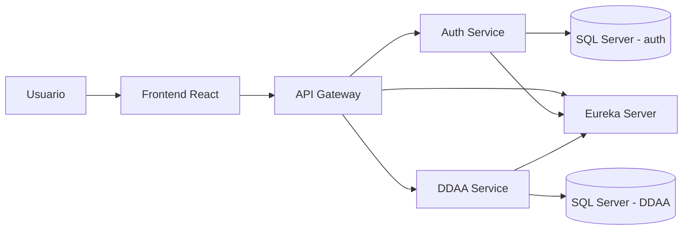

# DDAA Platform

## 1. Descripcion general

**DDAA Platform** es una solucion basada en microservicios para la gestion de derechos de aprovechamiento de aguas (DDAA). El proyecto ya cuenta con una base de autenticacion corporativa, descubrimiento de servicios, gateway centralizado, frontend inicial y un microservicio MVP para consultar y administrar informacion del dominio DDAA.

El estado actual de la plataforma incluye:

* **Eureka Server** para descubrimiento de servicios.
* **API Gateway** como punto unico de entrada.
* **Auth Service** para autenticacion con Google corporativo y persistencia de usuarios.
* **DDAA Service** como microservicio de negocio para derechos de agua, expedientes, catalogos y operaciones CRUD basicas.
* **Frontend React + Vite** como cliente web inicial.
* **SQL Server** para usuarios del servicio de autenticacion y para la base local del dominio DDAA.
* **H2 en memoria** solo para tests automatizados de `ddaa-service`.
* **Swagger/OpenAPI** para documentar APIs REST de `ddaa-service` y `auth-service`.

La arquitectura esta pensada para crecer por modulos, incorporando nuevas capacidades del dominio sin tener que reestructurar la base ya construida.

---

## 2. Arquitectura seleccionada

### 2.1 Microservicios

El proyecto usa una arquitectura de microservicios porque separa responsabilidades y permite evolucionar cada componente de forma independiente. Actualmente existen servicios separados para autenticacion, descubrimiento, gateway y dominio DDAA.

Esta decision facilita:

* aislar la autenticacion del negocio;
* centralizar el acceso externo por medio del gateway;
* registrar y descubrir servicios dinamicamente con Eureka;
* agregar nuevos servicios de negocio sin acoplarlos al frontend ni al servicio de autenticacion;
* escalar o reemplazar componentes de forma gradual.

### 2.2 Patrones aplicados

#### API Gateway Pattern

El `api-gateway` expone una entrada unica al sistema en `http://localhost:8080`. Desde ahi enruta:

* `/auth/**`, `/oauth2/**`, `/login/**` y `/logout` hacia `auth-service`;
* `/api/**` hacia `ddaa-service`.

Ademas, el gateway contiene un filtro global que protege las rutas `/api/**` consultando la sesion actual en `auth-service` mediante `/auth/me`.

#### Service Discovery Pattern

`eureka-server` permite que `api-gateway`, `auth-service` y `ddaa-service` se registren y puedan ser resueltos por nombre logico (`lb://auth-service`, `lb://ddaa-service`).

#### Database per Service

El proyecto sigue el principio de base de datos por servicio:

* `auth-service` usa SQL Server para usuarios internos y datos de autenticacion.
* `ddaa-service` usa SQL Server local en ejecucion normal mediante variables `DDAA_DB_*`.
* H2 queda reservado para pruebas automatizadas, donde permite ejecutar datos semilla sin depender de una base externa.

#### Backend for Frontend parcial

El `api-gateway` ya contiene una primera capa BFF dentro del paquete `bff`. Actualmente esa capa esta enfocada en la sesion del usuario y expone:

* `GET /bff/session`, que consulta `auth-service` mediante `/auth/me`;
* reenvio de headers de sesion (`Cookie` y `Authorization`) para conservar el contexto del navegador;
* respuesta anonima controlada cuando no hay sesion valida.

Esta implementacion usa `WebClient` con `@LoadBalanced`, por lo que el gateway puede llamar a `http://auth-service` usando Service Discovery/Eureka.

Importante: el CRUD DDAA aun no pasa por endpoints BFF propios. Por ahora el frontend o cualquier cliente consume `/api/**` y el gateway enruta esas llamadas directamente hacia `ddaa-service`, protegiendolas antes con el filtro de autenticacion. Para que el BFF quede completo, el siguiente paso arquitectonico es agregar endpoints BFF para las pantallas DDAA, por ejemplo `/bff/ddaa`, `/bff/ddaa/{id}`, catalogos agrupados y datos iniciales de formularios.

---

## 3. Diagrama actual



### Flujo general

1. El usuario entra al frontend.
2. El frontend consulta al gateway.
3. El frontend puede consultar `/bff/session` para conocer la sesion actual.
4. El gateway enruta autenticacion hacia `auth-service`.
5. El gateway enruta `/api/**` hacia `ddaa-service`.
6. Antes de permitir acceso a `/api/**`, el gateway valida la sesion consultando `/auth/me`.
7. Los servicios se registran en Eureka para discovery.

---

## 4. Estructura del proyecto

```text
ddaa-platform/
├── api-gateway/
├── auth-service/
├── data/
│   └── scripts/
│       └── model.sql
├── ddaa-service/
├── docs/
├── eureka-server/
├── frontend/
└── readme.md
```

### Modulos principales

| Modulo | Estado | Responsabilidad |
| --- | --- | --- |
| `eureka-server` | Implementado | Registro y descubrimiento de servicios. |
| `api-gateway` | Implementado con BFF parcial | Entrada unica, routing, proteccion de `/api/**` y BFF inicial de sesion. |
| `auth-service` | Implementado | Login Google, restriccion de dominio, persistencia de usuarios y Swagger acotado. |
| `ddaa-service` | MVP implementado | Entidades JPA del dominio, endpoints REST para derechos DDAA, expedientes, catalogos, CRUD basico y Swagger completo. |
| `frontend` | Base inicial | Login, consulta de usuario autenticado y home simple. |
| `data/scripts/model.sql` | Disponible | Modelo SQL de referencia usado como guia para las entidades JPA. |

---

## 5. Estado actual

### Implementado

* Registro de servicios con Eureka.
* Gateway con rutas a `auth-service` y `ddaa-service`.
* BFF inicial en `api-gateway` para consultar la sesion del frontend mediante `GET /bff/session`.
* Autenticacion con Google OAuth2/OpenID Connect.
* Restriccion de dominio corporativo `camanchaca.cl`.
* Persistencia de usuarios internos en SQL Server.
* Frontend React con flujo basico de login y home.
* Swagger/OpenAPI en `ddaa-service`.
* Swagger/OpenAPI acotado en `auth-service`.
* `ddaa-service` con:
  * `GET /api/ddaa`
  * `GET /api/ddaa/{id}`
  * `GET /api/ddaa/{id}/expedientes`
  * `GET /api/catalogos/cuencas`
  * `GET /api/catalogos/subcuencas`
  * `GET /api/catalogos/fuentes`
  * `POST /api/ddaa`
  * `PUT /api/ddaa/{id}`
  * `DELETE /api/ddaa/{id}`
* Modelo JPA completo para las tablas del dominio DDAA, incluyendo `COMUNA`, `RUTS` e `INSTALACION`.
* Repositorios JPA para las entidades del dominio.
* CRUD principal de `DDAA` implementado con JPA/Hibernate.
* Consultas de lectura compleja apoyadas temporalmente en `JdbcTemplate` para joins de detalle, expedientes, pagos y ejercicios.
* Creacion de tablas DDAA validada en SQL Server local mediante Hibernate/JPA.
* `data.sql` para levantar datos de test en H2.
* Test de integracion `DdaaCrudIntegrationTest`.

### Parcial o pendiente

* El frontend aun no tiene vistas ni formularios para el CRUD DDAA.
* Falta extender el BFF para los flujos DDAA; hoy el CRUD se consume por `/api/**` como ruta protegida del gateway, no como endpoints BFF especificos.
* `ddaa-service` aun no tiene wrapper Maven propio (`mvnw.cmd`/`.mvn`).
* Falta consolidar datos semilla reales para la base DDAA en SQL Server.
* Falta gestion avanzada de roles y permisos.
* Falta gestion documental completa.
* Falta observabilidad avanzada, trazabilidad distribuida y despliegue cloud formal.
* Conviene revisar que archivos locales con secretos no queden versionados.

---

## 6. Puertos de desarrollo

| Componente | Puerto | URL local |
| --- | ---: | --- |
| Eureka Server | 8761 | `http://localhost:8761` |
| API Gateway | 8080 | `http://localhost:8080` |
| Auth Service | 8081 | `http://localhost:8081` |
| DDAA Service | 8082 | `http://localhost:8082` |
| Frontend React | 5173 | `http://localhost:5173` |
| SQL Server | 1433 | `localhost:1433` |

---

## 7. Swagger / OpenAPI

### DDAA Service

Documentacion completa del contrato de negocio:

```text
http://localhost:8082/swagger-ui.html
http://localhost:8082/v3/api-docs
```

Incluye endpoints de:

* derechos DDAA;
* detalle por identificador;
* expedientes asociados;
* catalogos de cuencas, subcuencas y fuentes;
* creacion, actualizacion y eliminacion del MVP.

La documentacion declara dos servidores:

* `http://localhost:8080` para consumir via API Gateway;
* `http://localhost:8082` para consumir directo contra el servicio.

Las rutas `/api/**` estan protegidas cuando se consumen via gateway, usando la sesion creada por `auth-service`.

### Auth Service

Documentacion acotada de endpoints REST propios:

```text
http://localhost:8081/swagger-ui.html
http://localhost:8081/v3/api-docs
```

Incluye:

* `/auth/test`;
* `/auth/login`;
* `/auth/error`;
* `/auth/me`;
* `/auth/users`;
* `/auth/users/test`.

El flujo OAuth con Google se sigue probando desde navegador mediante:

```text
http://localhost:8080/oauth2/authorization/google
```

Swagger no intenta modelar el flujo completo de redirecciones OAuth, cookies y callback de Google.

---

## 8. Configuracion local

Los servicios importan configuracion local desde:

```text
local.properties
```

Variables usadas por `auth-service`:

```properties
DB_URL=jdbc:sqlserver://localhost:1433;databaseName=ddaa_auth;encrypt=true;trustServerCertificate=true
DB_USER=ddaa_user
DB_PASSWORD=tu_password
GOOGLE_CLIENT_ID=tu_google_client_id
GOOGLE_CLIENT_SECRET=tu_google_client_secret
ALLOWED_GOOGLE_DOMAIN=camanchaca.cl
EUREKA_DEFAULT_ZONE=http://localhost:8761/eureka/
```

Variables para `ddaa-service`:

```properties
DDAA_DB_URL=jdbc:sqlserver://localhost:1433;databaseName=ddaa;encrypt=true;trustServerCertificate=true
DDAA_DB_USER=ddaa_user
DDAA_DB_PASSWORD=tu_password
DDAA_DB_DRIVER=com.microsoft.sqlserver.jdbc.SQLServerDriver
DDAA_SQL_INIT_MODE=never
DDAA_JPA_DDL_AUTO=update
EUREKA_DEFAULT_ZONE=http://localhost:8761/eureka/
```

Con `DDAA_JPA_DDL_AUTO=update`, `ddaa-service` crea o actualiza las tablas a partir de las entidades del paquete `model`. `data/scripts/model.sql` se mantiene como referencia del diseno SQL original, pero la fuente activa del modelo en la aplicacion es JPA.

Antes de levantar `ddaa-service`, la base `ddaa` debe existir y el login configurado en `DDAA_DB_USER` debe tener permisos sobre ella. Hay un script auxiliar para preparar eso desde una sesion SQL Server con permisos de administrador:

```text
data/scripts/setup-ddaa-database.sql
```

Este script crea la base `ddaa` si no existe, crea o repara el login/usuario `ddaa_user`, asigna `ddaa` como base por defecto y entrega permisos locales de desarrollo para que Hibernate pueda crear y actualizar tablas. Incluye `db_owner` y permisos de lectura de metadata porque Hibernate/JDBC consulta informacion de indices al arrancar con `ddl-auto=update`.

Una vez iniciado `ddaa-service`, puedes verificar que las tablas fueron creadas ejecutando:

```sql
USE ddaa;

SELECT TABLE_NAME
FROM INFORMATION_SCHEMA.TABLES
WHERE TABLE_TYPE = 'BASE TABLE'
ORDER BY TABLE_NAME;
```

Nota de seguridad: `local.properties`, `.env` y cualquier archivo con credenciales reales deben mantenerse fuera de Git. El archivo `local_cloud.properties` tambien contiene configuracion sensible si se usa para entornos cloud.

---

## 9. Ejecucion local

Requisitos:

* Java 17.
* Node.js y npm para el frontend.
* Maven instalado globalmente o wrappers Maven funcionales por modulo.
* SQL Server local para ejecutar `auth-service` y `ddaa-service`.
* Credenciales Google OAuth configuradas para probar login real.

Orden recomendado:

1. `eureka-server`
2. `auth-service`
3. `ddaa-service`
4. `api-gateway`
5. `frontend`

### Eureka Server

```powershell
cd eureka-server
.\mvnw.cmd spring-boot:run
```

### Auth Service

```powershell
cd auth-service
.\mvnw.cmd spring-boot:run
```

### DDAA Service

Actualmente `ddaa-service` no trae wrapper Maven propio. Si tienes Maven instalado globalmente:

```powershell
mvn -f ddaa-service\pom.xml spring-boot:run
```

Si se agrega wrapper al modulo, el comando esperado seria:

```powershell
cd ddaa-service
.\mvnw.cmd spring-boot:run
```

### API Gateway

```powershell
cd api-gateway
.\mvnw.cmd spring-boot:run
```

### Frontend

```powershell
cd frontend
npm install
npm run dev
```

---

## 10. Endpoints relevantes

### Auth Service via gateway

#### Test simple

```http
GET http://localhost:8080/auth/test
```

Respuesta esperada:

```json
{
  "service": "auth-service",
  "status": "ok"
}
```

#### Login Google

```http
GET http://localhost:8080/oauth2/authorization/google
```

#### Usuario autenticado

```http
GET http://localhost:8080/auth/me
```

Ejemplo:

```json
{
  "authenticated": true,
  "name": "Nombre Usuario",
  "email": "usuario@camanchaca.cl",
  "googleId": "google-id",
  "domain": "camanchaca.cl"
}
```

#### Logout

```http
GET http://localhost:8080/logout
```

#### Listar usuarios internos

```http
GET http://localhost:8080/auth/users
```

### BFF via gateway

El BFF vive dentro de `api-gateway`. En esta etapa expone el estado de sesion para que el frontend no tenga que conocer directamente el contrato interno de `auth-service`.

```http
GET http://localhost:8080/bff/session
```

Respuesta con sesion valida:

```json
{
  "authenticated": true,
  "email": "usuario@camanchaca.cl"
}
```

Respuesta sin sesion valida:

```json
{
  "authenticated": false
}
```

### DDAA Service via gateway

Las rutas DDAA se exponen por el gateway bajo `/api/**` y requieren sesion autenticada.

```http
GET http://localhost:8080/api/ddaa
GET http://localhost:8080/api/ddaa/{id}
GET http://localhost:8080/api/ddaa/{id}/expedientes
GET http://localhost:8080/api/catalogos/cuencas
GET http://localhost:8080/api/catalogos/subcuencas
GET http://localhost:8080/api/catalogos/fuentes
POST http://localhost:8080/api/ddaa
PUT http://localhost:8080/api/ddaa/{id}
DELETE http://localhost:8080/api/ddaa/{id}
```

Ejemplo de creacion:

```http
POST http://localhost:8080/api/ddaa
Content-Type: application/json

{
  "comunaId": "001",
  "rutTitular": 11111111,
  "instalacionId": null,
  "fuenteId": 1,
  "nombreFuenteDerecho": "Fuente X",
  "naturalezaDerecho": "Privado",
  "tipoDerecho": "Titulo",
  "estadoDerecho": "Activo"
}
```

Respuesta esperada:

```json
{
  "id": 1
}
```

---

## 11. Testing

### DDAA Service

El proyecto incluye una prueba de integracion:

```text
ddaa-service/src/test/java/com/ddaa/ddaaservice/DdaaCrudIntegrationTest.java
```

La prueba valida un ciclo basico:

1. crea datos referenciales minimos;
2. crea un DDAA;
3. consulta el DDAA creado;
4. actualiza el registro;
5. elimina el registro.

Si tienes Maven instalado globalmente:

```powershell
mvn -f ddaa-service\pom.xml test
```

Los reportes Maven se generan en `ddaa-service/target/`, pero esa carpeta no se versiona.

### Frontend

Comandos disponibles:

```powershell
cd frontend
npm run dev
npm run build
npm run lint
```

---

## 12. Tecnologias utilizadas

* Java 17
* Spring Boot
* Spring Cloud Gateway
* Spring WebFlux / WebClient en `api-gateway`
* Eureka Server / Eureka Client
* Spring Security
* OAuth2 / OpenID Connect
* SQL Server
* H2 Database solo para tests
* Spring Data JPA / Hibernate en `auth-service` y `ddaa-service`
* Spring JDBC / JdbcTemplate para consultas complejas de lectura en `ddaa-service`
* springdoc-openapi / Swagger UI
* React
* Vite
* Maven

---

## 13. Evaluacion del estado actual

El proyecto ya no esta solamente en una etapa de autenticacion. La base de microservicios esta operativa y se incorporo un primer servicio de negocio (`ddaa-service`) con endpoints reales, modelo de datos local, pruebas de integracion y documentacion Swagger/OpenAPI.

La principal brecha funcional esta en la interfaz: el frontend aun no consume el CRUD DDAA ni presenta pantallas de gestion. Como el BFF es una pieza central del proyecto, la integracion del frontend deberia avanzar extendiendo primero el BFF del gateway para los flujos DDAA y luego consumiendo esos endpoints desde React. La segunda brecha tecnica es la falta de wrapper Maven propio para `ddaa-service`, lo que hace menos uniforme la ejecucion respecto de los otros modulos.

En terminos de arquitectura, el proyecto esta bien encaminado: gateway, discovery, autenticacion, BFF inicial y servicio de dominio ya conviven bajo el mismo esquema. Los siguientes pasos naturales son ampliar el BFF para DDAA, integrar las vistas DDAA en el frontend, consolidar la base de datos del dominio y formalizar seguridad/autorizacion por roles.
