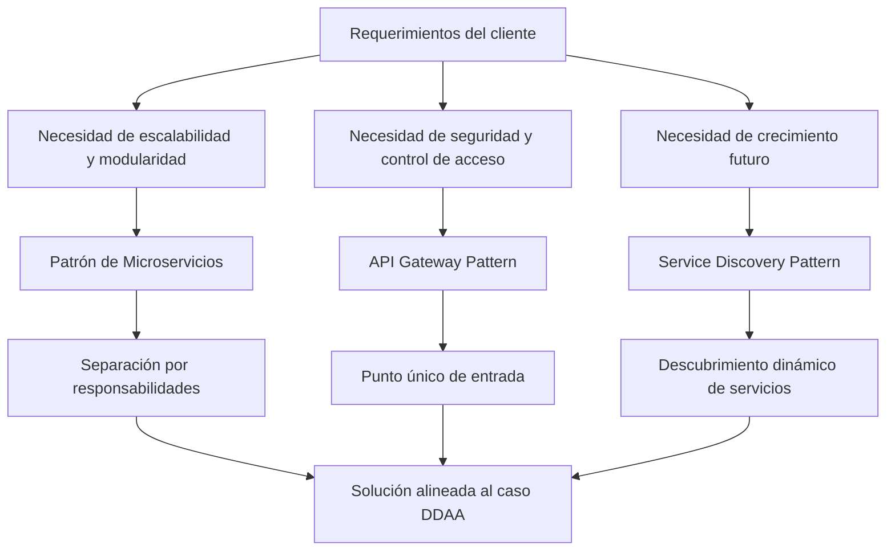
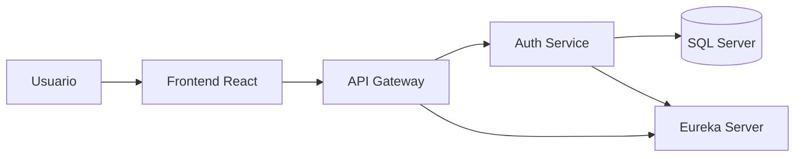

# DDAA Platform

## 1. Descripción general del proyecto

**DDAA Platform** es una solución basada en microservicios orientada a la gestión de derechos de aprovechamiento de aguas (DDAA). El objetivo del proyecto es construir una plataforma escalable, segura y mantenible que permita centralizar procesos relacionados con autenticación, acceso de usuarios corporativos y, posteriormente, la gestión del negocio específico asociado al dominio del cliente.

En esta primera etapa se ha implementado la base arquitectónica del sistema, compuesta por:

* **Eureka Server** para descubrimiento de servicios.
* **API Gateway** como punto único de entrada.
* **Auth Service** como microservicio de autenticación.
* **Frontend React** como cliente web inicial.
* **SQL Server** como base de datos local para persistencia de usuarios.
* **Google Login corporativo** con restricción de dominio.

La arquitectura fue diseñada para crecer de manera incremental, permitiendo incorporar nuevos microservicios del dominio DDAA sin modificar la base estructural ya construida.

---

## 2. Selección de patrones de arquitectura

### 2.1 Patrón principal: Arquitectura de microservicios

Se seleccionó una **arquitectura de microservicios** porque el caso requiere una solución modular, extensible y preparada para crecer a medida que el sistema incorpore nuevas capacidades de negocio. En un contexto como la gestión de derechos de agua, es esperable que a futuro existan procesos diferenciados tales como:

* autenticación y gestión de usuarios,
* gestión de expedientes,
* gestión documental,
* trazabilidad de solicitudes,
* integración con servicios externos,
* reportabilidad y analítica.

Una arquitectura monolítica podría resolver una primera versión funcional, pero dificultaría la evolución del sistema, el aislamiento de responsabilidades y la escalabilidad selectiva. En cambio, los microservicios permiten separar el sistema en componentes especializados, con responsabilidades bien definidas y menor acoplamiento.

### 2.2 Patrones seleccionados

#### a) API Gateway Pattern

Se incorporó un **API Gateway** como puerta única de entrada al sistema. Este patrón permite centralizar el acceso a los microservicios y aporta varias ventajas:

* simplifica el consumo desde el frontend,
* oculta la topología interna del sistema,
* facilita la incorporación de reglas comunes de seguridad,
* permite gestionar futuras políticas de routing, logging, control de tráfico y validación.

En el caso del cliente, este patrón ayuda a construir una solución más ordenada y segura, ya que evita exponer directamente múltiples servicios internos.

#### b) Service Discovery Pattern

Se utilizó **Service Discovery** mediante Eureka Server para permitir que los microservicios se registren y descubran dinámicamente. Esto resulta especialmente útil en entornos distribuidos donde los servicios pueden crecer, moverse o replicarse.

Este patrón aporta flexibilidad operativa y reduce la dependencia de configuraciones rígidas basadas en URLs fijas.

#### c) Database per Service (aplicable como principio de evolución)

En esta etapa solo se ha implementado la base de datos del servicio de autenticación, pero el diseño sigue el principio de **base de datos por servicio**, donde cada microservicio administra sus propios datos según su responsabilidad.

Este enfoque favorece:

* el aislamiento de datos,
* la autonomía de los servicios,
* una mejor evolución del modelo de datos,
* menor acoplamiento entre módulos.

#### d) Backend for Frontend simplificado mediante Gateway

Aunque no se implementó un BFF dedicado, el uso del gateway como punto único de acceso cumple parcialmente un rol similar para el cliente web, al unificar el acceso a autenticación y a futuros microservicios.

---

## 3. Justificación de la selección de herramientas y estrategias

### 3.1 Spring Boot

Se eligió **Spring Boot** para el desarrollo de los microservicios por su madurez, ecosistema amplio y fuerte integración con componentes empresariales. Su uso permite acelerar el desarrollo, reducir configuración manual y estructurar servicios bajo principios sólidos de modularización y orientación a objetos.

Aporta eficiencia técnica porque:

* reduce código repetitivo,
* simplifica la configuración de servicios REST,
* facilita la integración con seguridad, base de datos y descubrimiento de servicios,
* permite una evolución progresiva de la arquitectura.

### 3.2 Spring Cloud

Se utilizó **Spring Cloud** para resolver capacidades propias de sistemas distribuidos, en particular:

* **Eureka Server / Eureka Client** para descubrimiento de servicios,
* **Spring Cloud Gateway** como gateway reactivo.

Estas herramientas mejoran la eficiencia operativa porque permiten administrar la comunicación entre servicios de forma más flexible, escalable y centralizada.

### 3.3 SQL Server

Se seleccionó **SQL Server** como motor de base de datos debido a su robustez, soporte empresarial y compatibilidad con entornos corporativos donde suele ser una tecnología ampliamente adoptada.

En esta etapa se utiliza en entorno local para pruebas y desarrollo, permitiendo validar persistencia real del servicio de autenticación.

### 3.4 Spring Data JPA + Hibernate

Se optó por **Spring Data JPA** con **Hibernate** para simplificar la persistencia de datos y reducir la complejidad de acceso a base de datos.

Su aporte principal es:

* acelerar el desarrollo,
* reducir código boilerplate,
* facilitar la evolución del modelo de datos,
* mantener una separación clara entre lógica de negocio y acceso a datos.

### 3.5 Google OAuth 2.0 / OpenID Connect

Se integró **Google Login corporativo** usando OAuth 2.0 / OpenID Connect para ofrecer autenticación segura y alineada con una organización que ya utiliza Google Workspace.

Esta decisión aporta eficiencia técnica y operativa porque:

* evita construir un sistema propio de credenciales,
* aprovecha la infraestructura de identidad ya existente del cliente,
* reduce riesgos asociados al manejo directo de contraseñas,
* mejora la experiencia del usuario final.

### 3.6 React + Vite

Para el frontend se eligió **React** con **Vite** por su rapidez de desarrollo, simplicidad de configuración inicial y buena integración con APIs modernas.

Su uso aporta:

* rapidez para construir interfaces,
* estructura modular basada en componentes,
* facilidad para escalar a medida que crezca la aplicación,
* una experiencia ágil de desarrollo local.

### 3.7 Estrategia de implementación incremental

Se definió una estrategia incremental, comenzando por la infraestructura base y la autenticación antes de construir la lógica de negocio del dominio DDAA.

Esta estrategia fue elegida porque:

* permite validar la arquitectura desde el inicio,
* reduce retrabajo futuro,
* asegura que los nuevos módulos se integren sobre una base estable,
* facilita el aprendizaje y la comprensión del sistema.

---

## 4. Esquema de selección de patrones de arquitectura



Este esquema resume la lógica de selección. Los patrones elegidos permiten responder a requerimientos de crecimiento, orden estructural, control centralizado de acceso y evolución progresiva del sistema.

---

## 5. Diagrama de arquitectura de microservicios propuesta



### Descripción del diagrama

* El **usuario** interactúa con el **frontend React**.
* El frontend se comunica con el **API Gateway**, que actúa como único punto de entrada.
* El gateway enruta las solicitudes al **Auth Service**.
* El Auth Service consulta y persiste información en **SQL Server**.
* Tanto el gateway como el servicio de autenticación se registran en **Eureka Server** para su descubrimiento.

---

## 6. Consideraciones de seguridad, privacidad y sostenibilidad

### 6.1 Seguridad

La arquitectura considera la seguridad como un eje central desde la etapa inicial:

* El acceso se canaliza mediante **API Gateway**, evitando exponer directamente los servicios internos.
* La autenticación se delega a **Google Workspace**, reduciendo el riesgo de gestionar contraseñas manualmente.
* Se restringe el acceso a usuarios del dominio corporativo autorizado (`camanchaca.cl`).
* El sistema genera un usuario interno propio en base de datos, permitiendo futuras políticas de roles, auditoría y control fino de permisos.
* La configuración sensible se externaliza usando variables de entorno y archivos locales excluidos de Git.

### 6.2 Privacidad

La solución evita almacenar credenciales del usuario final en la aplicación. En su lugar, utiliza identidad federada mediante Google. Esto disminuye la exposición de información sensible y facilita el cumplimiento de buenas prácticas de protección de datos.

Adicionalmente, la separación por servicios permite que cada componente maneje únicamente los datos que necesita, favoreciendo el principio de mínimo conocimiento.

### 6.3 Sostenibilidad

La sostenibilidad del diseño se aborda desde varios frentes:

* **Sostenibilidad técnica**: una arquitectura modular es más fácil de mantener, extender y corregir a largo plazo.
* **Sostenibilidad operativa**: la separación de servicios facilita desplegar, monitorear y evolucionar componentes sin afectar todo el sistema.
* **Sostenibilidad organizacional**: permite incorporar nuevas funcionalidades del dominio DDAA de forma ordenada, reduciendo deuda técnica futura.

En términos prácticos, esta arquitectura favorece ciclos de mejora continua sin necesidad de rehacer la base del sistema.

---

## 7. Evaluación general del diseño propuesto

El diseño actual responde adecuadamente a los requerimientos iniciales del cliente y sienta una base consistente para continuar el desarrollo del sistema.

### Fortalezas del diseño

* Define una arquitectura moderna, modular y escalable.
* Aísla la autenticación como una responsabilidad independiente.
* Centraliza el acceso mediante gateway.
* Usa descubrimiento de servicios, facilitando el crecimiento futuro.
* Integra autenticación corporativa real con Google Workspace.
* Persiste usuarios internos, permitiendo extender la solución hacia autorización basada en roles y auditoría.
* Mantiene una estructura de proyecto ordenada, comprensible y preparada para crecer.

### Limitaciones actuales

* Solo se ha implementado el microservicio de autenticación.
* El frontend es todavía una base inicial.
* Aún no se han desarrollado los microservicios propios del negocio DDAA.
* No se ha incorporado todavía observabilidad avanzada, trazabilidad distribuida ni despliegue productivo.

### Evaluación final

Aun cuando el proyecto se encuentra en una etapa temprana, el diseño propuesto es coherente con los requerimientos funcionales y técnicos del caso. La solución construida hasta ahora no solo permite autenticar usuarios corporativos de manera segura, sino que también establece una arquitectura sólida para incorporar progresivamente los servicios específicos del dominio de gestión de derechos de agua.

---

## 8. Estado actual del proyecto

### Implementado

* Eureka Server
* API Gateway
* Auth Service
* SQL Server local
* Persistencia de usuarios
* Login Google corporativo
* Restricción por dominio `camanchaca.cl`
* Frontend React básico

### Pendiente

* Integración completa frontend-backend en flujo final de navegación
* Nuevos microservicios del dominio DDAA
* Gestión de roles y permisos avanzados
* Gestión documental y expedientes
* Observabilidad y monitoreo
* Despliegue en infraestructura cloud

---

## 9. Sección técnica de implementación y testing

### 9.1 Estructura actual de servicios

La solución implementada hasta esta etapa se compone de los siguientes módulos:

```text
ddaa-platform/
├── eureka-server/
├── api-gateway/
├── auth-service/
└── frontend/
```

### 9.2 Puertos utilizados en desarrollo local

| Componente            | Puerto | Descripción                            |
| --------------------- | -----: | -------------------------------------- |
| Eureka Server         |   8761 | Registro y descubrimiento de servicios |
| API Gateway           |   8080 | Punto único de entrada al sistema      |
| Auth Service          |   8081 | Microservicio de autenticación         |
| Frontend React (Vite) |   5173 | Cliente web de desarrollo              |
| SQL Server            |   1433 | Base de datos local                    |

### 9.3 URLs principales para testing local

#### Eureka Server

```text
http://localhost:8761
```

Permite verificar que los servicios se registren correctamente en Eureka.

#### API Gateway

```text
http://localhost:8080
```

Se utiliza como entrada principal para las pruebas del backend.

#### Frontend React

```text
http://localhost:5173
```

Permite probar la experiencia de login desde la interfaz web.

### 9.4 Endpoints relevantes implementados

#### Auth Service a través del API Gateway

##### Verificación simple del servicio

```http
GET http://localhost:8080/auth/test
```

**Respuesta esperada:**

```json
{
  "service": "auth-service",
  "status": "ok"
}
```

##### Inicio de sesión con Google

```http
GET http://localhost:8080/oauth2/authorization/google
```

Este endpoint inicia el flujo de autenticación corporativa mediante Google Workspace.

##### Información del usuario autenticado

```http
GET http://localhost:8080/auth/me
```

**Ejemplo de respuesta esperada:**

```json
{
  "authenticated": true,
  "name": "Fabian Lecaros",
  "email": "fabian.lecaros@camanchaca.cl",
  "googleId": "107293895174367357436",
  "domain": "camanchaca.cl"
}
```

##### Logout

```http
GET http://localhost:8080/logout
```

Cierra la sesión de la aplicación.

##### Endpoint de error de autenticación

```http
GET http://localhost:8080/auth/error
```

Se utiliza cuando falla la autenticación o el dominio del correo no está autorizado.

##### Crear usuario manual de prueba

```http
POST http://localhost:8080/auth/users/test
Content-Type: application/json
```

**Body de ejemplo:**

```json
{
  "googleId": "google-test-001",
  "name": "Usuario Prueba",
  "email": "usuario.prueba@camanchaca.cl",
  "role": "ADMIN",
  "active": true
}
```

##### Listar usuarios internos

```http
GET http://localhost:8080/auth/users
```

Este endpoint permite comprobar que los usuarios se almacenan correctamente en la base de datos interna.

### 9.5 Flujo técnico de autenticación implementado

El flujo actual opera de la siguiente manera:

1. El usuario accede al frontend React.
2. El frontend redirige al endpoint `/oauth2/authorization/google` del gateway.
3. El gateway reenvía la solicitud al `auth-service`.
4. Google autentica al usuario.
5. Google redirige el callback al gateway.
6. El gateway reenvía el callback al `auth-service`.
7. El `auth-service` valida que el correo pertenezca al dominio autorizado.
8. El `auth-service` crea o actualiza un usuario interno en SQL Server.
9. El usuario autenticado puede consultar `/auth/me`.

### 9.6 Validaciones de seguridad implementadas

Actualmente se encuentran operativas las siguientes validaciones:

* autenticación con Google Workspace,
* restricción de acceso por dominio corporativo,
* validación de correo verificado,
* persistencia de usuario interno para trazabilidad futura,
* acceso a servicios internos a través del gateway.

### 9.7 Configuración local y buenas prácticas

La configuración sensible se externaliza usando variables en `application.yml` y un archivo `local.properties` fuera de Git.

Ejemplo de variables utilizadas:

```properties
DB_URL=jdbc:sqlserver://localhost:1433;databaseName=ddaa_auth;encrypt=true;trustServerCertificate=true
DB_USER=ddaa_user
DB_PASSWORD=tu_password
GOOGLE_CLIENT_ID=tu_google_client_id
GOOGLE_CLIENT_SECRET=tu_google_client_secret
ALLOWED_GOOGLE_DOMAIN=camanchaca.cl
EUREKA_DEFAULT_ZONE=http://localhost:8761/eureka/
```

### 9.8 Orden recomendado de ejecución en desarrollo

Para levantar correctamente la solución local, se recomienda iniciar los componentes en el siguiente orden:

1. `eureka-server`
2. `api-gateway`
3. `auth-service`
4. `frontend`

### 9.9 Pruebas técnicas mínimas recomendadas

Para comprobar que la solución se encuentra operativa, se recomienda verificar:

1. que `API-GATEWAY` y `AUTH-SERVICE` aparezcan registrados en Eureka,
2. que `GET /auth/test` responda correctamente desde el gateway,
3. que el login Google funcione solo con cuentas `@camanchaca.cl`,
4. que un usuario autenticado quede registrado en la tabla `users`,
5. que el frontend React pueda consultar `/auth/me`.

## 10. Tecnologías utilizadas

* Java 17+
* Spring Boot
* Spring Cloud Gateway
* Eureka Server / Eureka Client
* Spring Security
* OAuth2 / OpenID Connect
* SQL Server
* Spring Data JPA / Hibernate
* React
* Vite
* Maven

---

## 11. Conclusión

La solución propuesta para DDAA Platform adopta una arquitectura moderna basada en microservicios, alineada con las necesidades de escalabilidad, seguridad y mantenibilidad del caso. La incorporación temprana de patrones como API Gateway y Service Discovery permite construir una base robusta para la evolución futura del sistema.

La implementación realizada hasta ahora demuestra que la arquitectura es técnicamente viable, funcional y coherente con los requerimientos del cliente, constituyendo un punto de partida sólido para el desarrollo posterior de los servicios de negocio propios de la gestión de derechos de agua.
